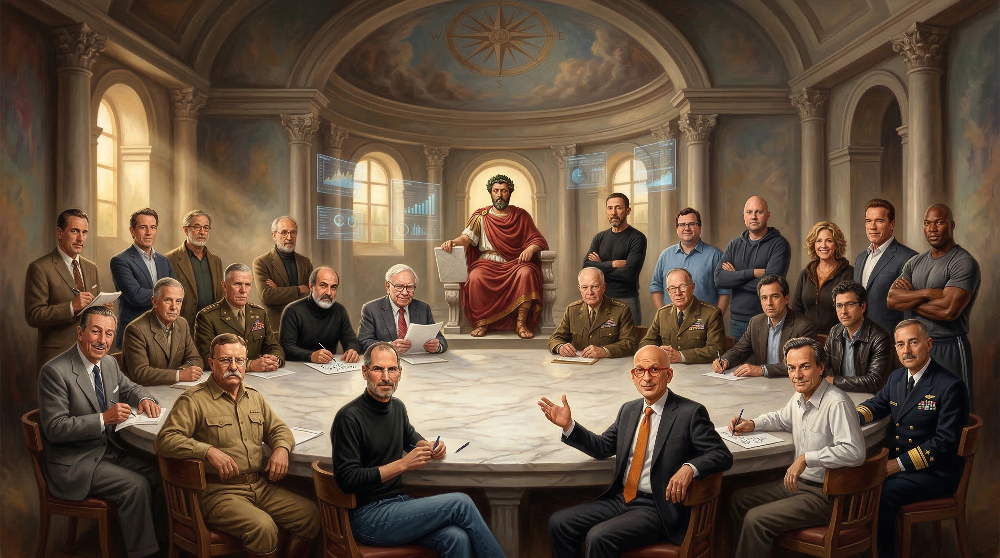

# Board of Directors

**25 AI agents. Structured debate. Stoic judgment.**

A multi-agent deliberation system that convenes panels of historical and modern figures to debate strategic decisions. Built for [Claude Code](https://claude.ai/code) and [Google Antigravity IDE](https://blog.google/technology/google-labs/project-mariner-gemini/#antigravity), with Notion as the command center.



## How It Works

1. **Pose a question** - any strategic decision
2. **3 experts are selected** from a roster of 25 historical and modern figures
3. **5-phase deliberation** - Individual Reports, Combined Analysis, Debate, Mediation (if needed), Final Judgment
4. **Marcus Aurelius renders the verdict** - applying Stoic principles of justice, wisdom, courage, and temperance

## The Rule of Three

Every deliberation requires **exactly 3 agents**. One agent lacks tension. Two creates deadlock. Three enables triangulation.

Marcus Aurelius (arbiter) and Chris Voss (mediator) serve structural roles outside the panel.

## Agent Roster (25 Total)

### Perspective Agents (4)
| Agent | Lens |
|-------|------|
| Walt Disney | Optimist |
| George Marshall | Realist |
| Nassim Taleb | Pessimist |
| Theodore Roosevelt | Operator |

### Domain Agents (19)
Warren Buffett, Steve Jobs, Ernest Hemingway, Seth Godin, Admiral James Stavridis, Richard Feynman, Dario & Daniela Amodei, Jensen Huang, Peter Drucker, Clayton Christensen, Dwight Eisenhower, Reid Hoffman, Marc Andreessen, Ben Horowitz, Brene Brown, Adam Grant, Mel Robbins, Arnold Schwarzenegger, Bo Jackson

### Structural Roles
| Agent | Role |
|-------|------|
| Chris Voss | Mediator (Phase 3.5, conditional) |
| Marcus Aurelius | Arbiter (Phase 4, always) |

## Decision Router (17 Categories)

The system automatically selects the right panel for the question:

| Category | Default Panel |
|----------|---------------|
| Strategic Business | Marshall + Christensen + Buffett |
| Product & Design | Jobs + Godin + Disney |
| Investment & Capital | Buffett + Taleb + Andreessen |
| Operations & Execution | Eisenhower + Horowitz + Roosevelt |
| Risk Assessment | Taleb + Marshall + Stavridis |
| Technology | Huang + Feynman + Andreessen |
| Writing & Comms | Hemingway + Godin + Jobs |
| Startup & Scaling | Hoffman + Horowitz + Christensen |
| AI & ML | Amodei + Huang + Feynman |
| Defense & Government | Stavridis + Eisenhower + Marshall |
| Management & Organization | Drucker + Eisenhower + Horowitz |
| Consulting & Advisory | Drucker + Buffett + Marshall |
| Personal Development | Brown + Robbins + Grant |
| Creativity & Innovation | Grant + Disney + Feynman |
| Physical & Discipline | Schwarzenegger + Jackson + Roosevelt |
| Action & Motivation | Robbins + Roosevelt + Schwarzenegger |
| Multi-Domain Success | Jackson + Hoffman + Grant |

## Platforms

### Claude Code (Notion MCP)

The `claude-code/convene-council/SKILL.md` skill runs the full deliberation protocol and posts every phase to a Notion workspace using 4 Notion MCP tools across 3 databases.

Install: Copy to `~/.claude/skills/convene-council/SKILL.md`

Usage:
```
/convene-council Should I accept this acquisition offer?
/convene-council with Buffett, Taleb, Horowitz: Should we take this term sheet?
/convene-council recommend: Should I pivot from services to SaaS?
```

### Google Antigravity IDE

The original system. Copy `system/`, `workflows/`, and `skills/` to your Antigravity workspace. Merge `BOD-GEMINI.md` into your `GEMINI.md`.

## Repo Structure

```
board-of-directors/
├── claude-code/                  # Claude Code integration
│   └── convene-council/
│       └── SKILL.md              # Orchestration skill (600 lines)
├── system/                       # Core BOD system
│   ├── agents/                   # 25 agent profiles
│   │   ├── arbiter/              # Marcus Aurelius
│   │   ├── domain/               # 19 subject matter experts
│   │   ├── mediator/             # Chris Voss
│   │   ├── perspective/          # 4 lens agents
│   │   └── custom/               # User-defined agents
│   ├── rules/                    # 9 orchestration protocols
│   ├── templates/                # Output format templates
│   └── examples/                 # Example deliberation
├── workflows/                    # Antigravity IDE workflows
├── integrations/n8n/             # n8n automation workflows
├── skills/                       # Additional skills
│   └── BOD-masterclass-scout/    # Agent discovery skill
└── assets/header/                # Header images
```

## License

MIT
